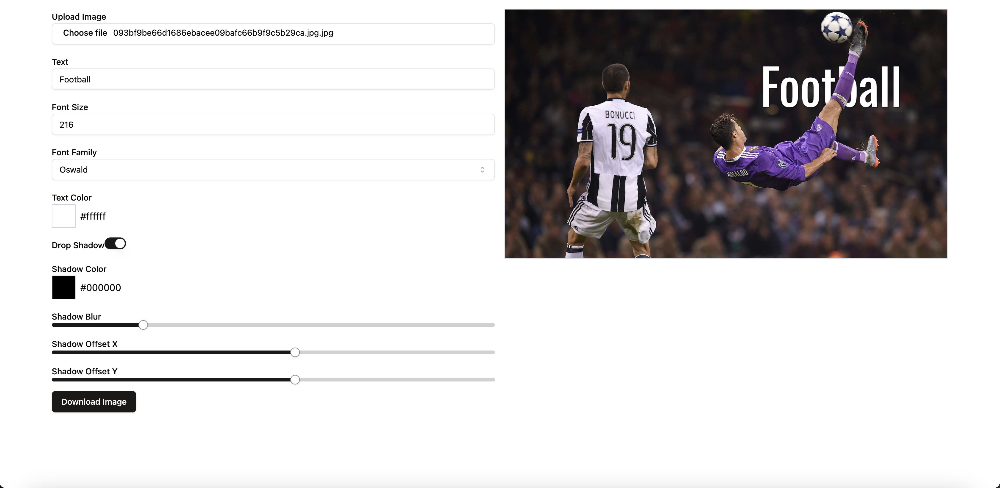

# Text Behind Image Editor



## Description

Text Behind Image Editor is a simple web application that allows users to add custom text behind an image after removing the background. The text is then sandwiched between the foreground and the background of the image. Users can adjust the position of the text by dragging it and customize various aspects of the text such as:

- **Text Color**
- **Font Family**
- **Font Size**
- **Drop Shadow Options** (including blur, offset, and shadow color)

### Features:
- Upload an image and remove its background.
- Add customizable text that can be dragged and repositioned on the image.
- Change the text font, color, size, and add shadows.
- Live preview of the final image.
- Download the edited image directly.

## How to Use:

1. **Upload an Image**: Start by selecting or dragging an image into the app.
2. **Customize Text**: Enter the desired text and adjust its font, size, and color.
3. **Position the Text**: Drag and drop the text on the image to place it wherever you like.
4. **Customize Shadow**: Turn on the shadow option to adjust shadow color, blur, and offset.
5. **Download**: Click on the "Download Image" button to get your final image.

## Preview:


## Installation:

To run this app locally:

1. Clone the repository:

   ```bash
   git clone https://github.com/thefallenmerc/text-behind-image-editor.git
